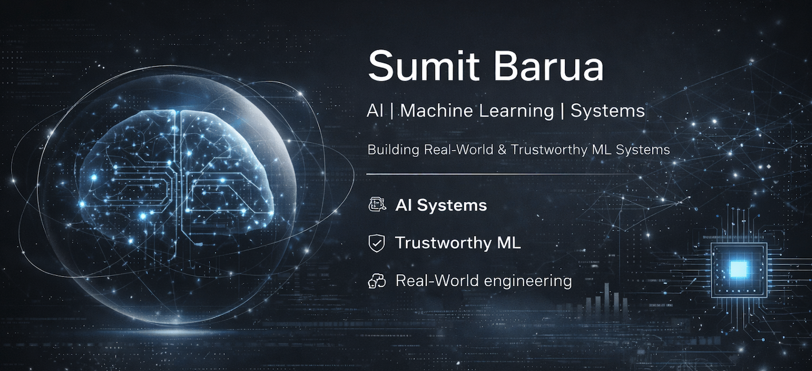

  

# 👋 Hi, I'm Sumit 

  
  
  

---

🎓 **MS Computer Science @ Western Michigan University**  
🚀 Building **real-world AI systems, data tools, and trustworthy ML pipelines**

---

## 🧠 What I Do

- Build **AI-powered systems** (RAG, computer vision, ML pipelines)  
- Design **explainable and reliable ML frameworks**  
- Develop **production-style Python tools (CLI + backend systems)**  
- Focus on **real-world deployment and system design**  

---

## 🔬 Current Focus

  
  
  
  

- Retrieval-Augmented Generation (RAG) for reliable decision systems  
- Explainable AI (XAI) in healthcare applications  
- Data engineering + ML pipelines  
- CLI tools & backend systems  

---

## 🚀 Featured Projects

### 🧾 RAG-Based Housing Law QA System
- Evidence-grounded legal Q&A system  
- Reduces hallucination via retrieval + validation  
- Built with vector search and LLM integration  

🔗 https://github.com/sum1tbarua/RAG-Based-Housing-Law-QA-System

---

### ⚕️AI Wound Detection and First-Aid Recommendation Application
- YOLOv11 for wound segmentation + ResNet-50 for anatomical classification
- Grad-CAM heatmap generation
- Mistral AI via Ollama for first-aid generation
- LLM-XAI using natural language explanation for interpretation 
- Real-world healthcare AI pipeline  

🔗 https://github.com/sum1tbarua/wound_detection_app

---

### 🩺 Explainable AI Behavioral Diabetes Predictor
- Takes behavioral, demographic, and anthropometric details as inputs  
- Performs real-time analysis and prediction of 3 classes (Diabetic, Prediabetic, and Non-diabetic)  
- Uses explainable AI, SHAP, to break down feature contributions to prediction results  

🔗 https://github.com/sum1tbarua/behavioral-diabetes-predictor

---

## 🧰 Tech Stack

  
  
  
  
  
  
  
  

---

## 📊 GitHub Stats

  

---

## 🎯 Research Direction

I focus on building:

- Trustworthy AI systems  
- Explainable ML pipelines  
- Real-world deployable AI applications  

With applications in:

- Healthcare AI  
- Secure AI systems  
- Reliable LLM-based systems  

---

## 📫 Connect

  
  

